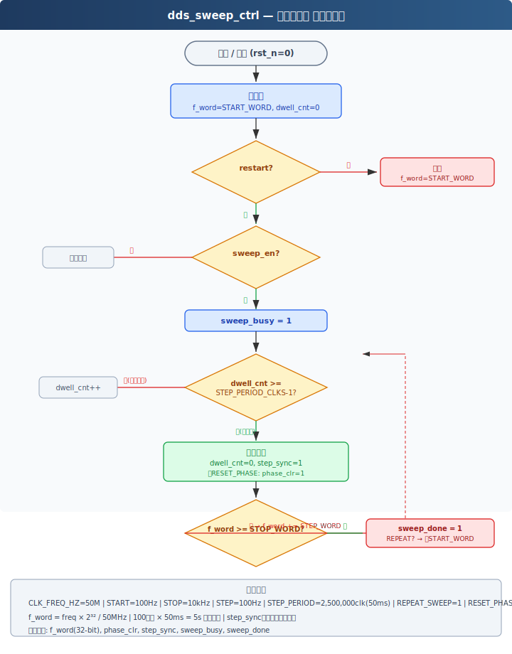
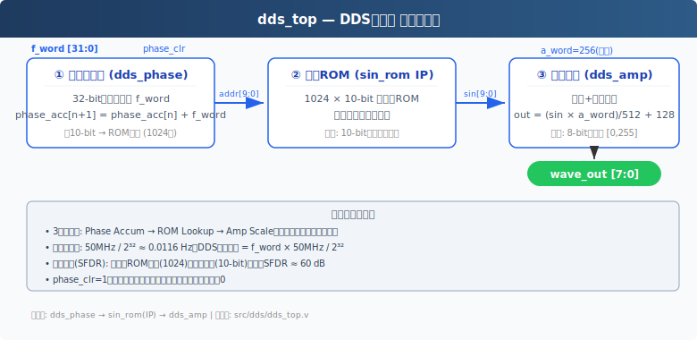
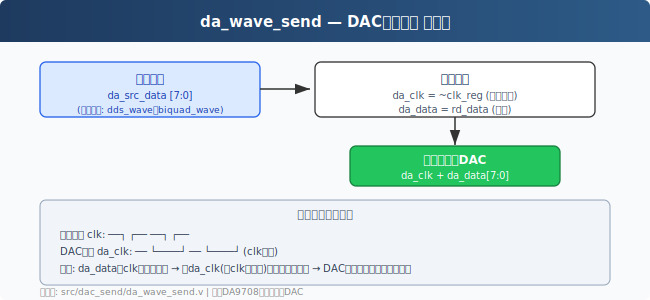
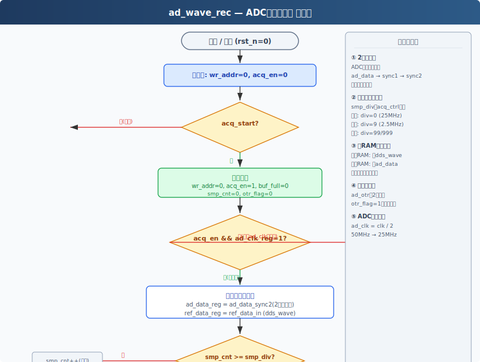
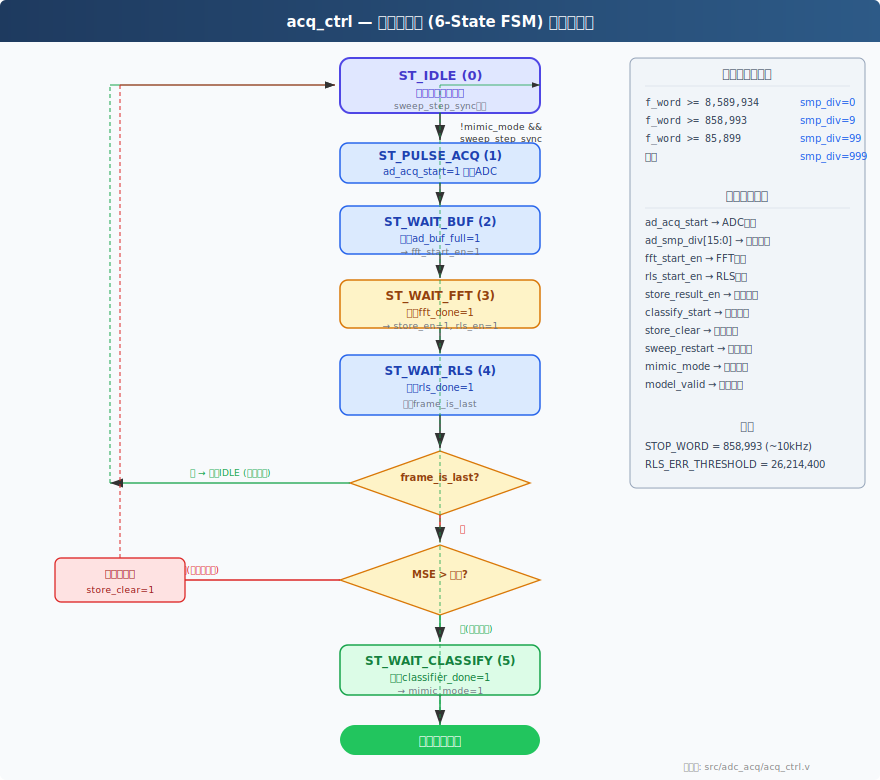
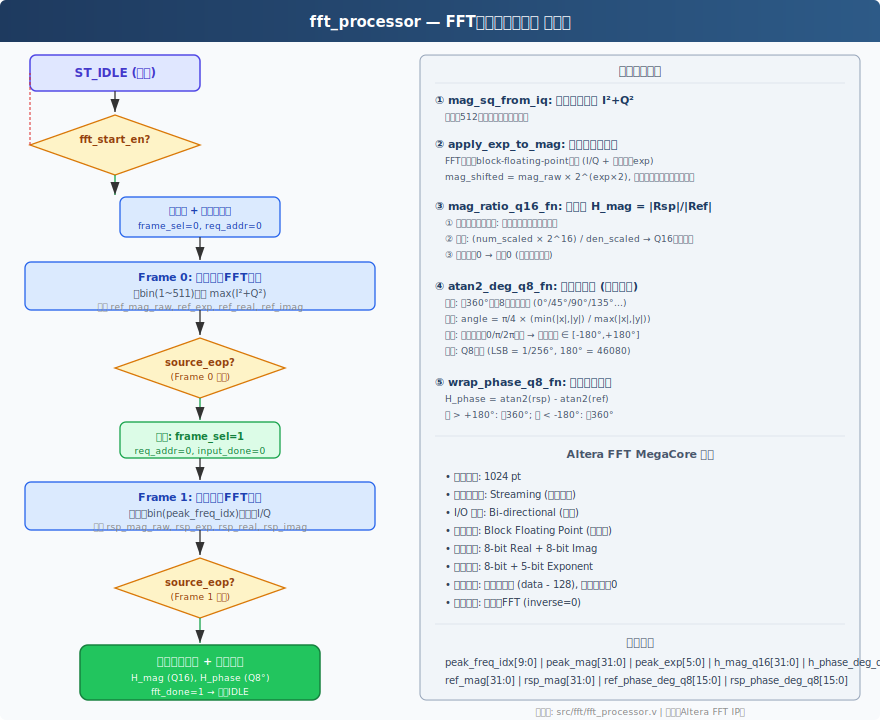
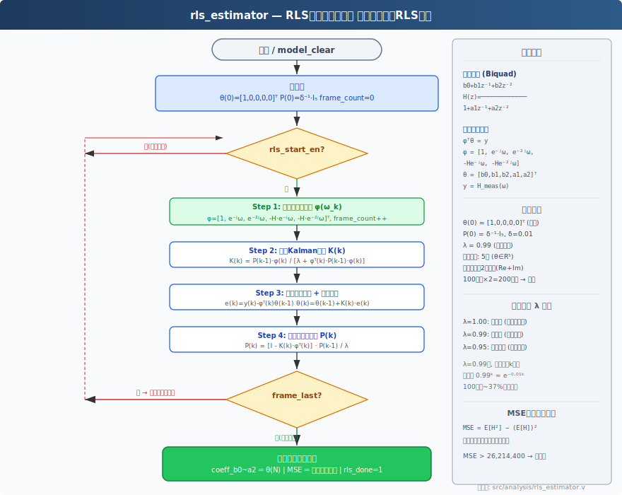
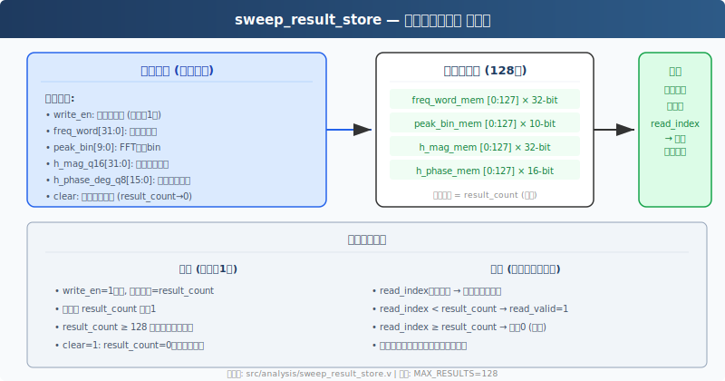
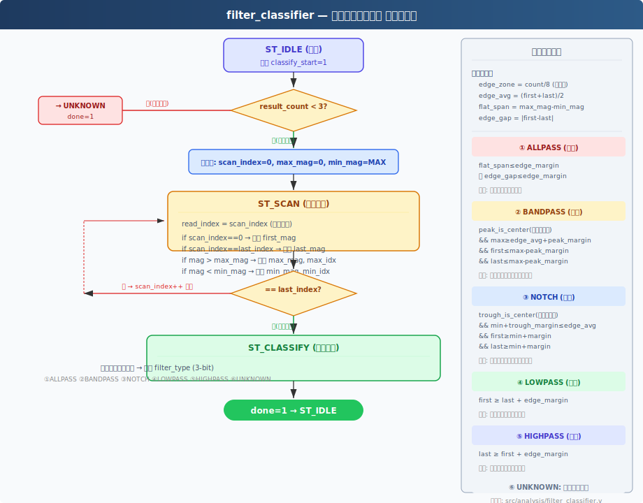

# 未知模型探究装置——各模块软件流程图与详细介绍

---

## 模块总览

系统共包含9个自定义Verilog模块，按功能可分为四组：

| 分组 | 模块 | 功能 |
|------|------|------|
| **信号生成** | `dds_sweep_ctrl`, `dds_top` | 扫频控制 + DDS正弦波生成 |
| **接口与采集** | `da_wave_send`, `ad_wave_rec` | DAC发送 + ADC采集 |
| **主控与频域分析** | `acq_ctrl`, `fft_processor` | 流水线编排 + FFT频谱分析 |
| **系统辨识** | `rls_estimator`, `sweep_result_store`, `filter_classifier` | 参数估计 + 数据存储 + 类型分类 |

---

## 一、dds_sweep_ctrl — 扫频控制器

### 1.1 功能概述

生成线性扫频的频率控制字（f_word）序列，控制DDS在每个频率点的驻留时间（dwell time）。扫频范围100Hz~10kHz，步长100Hz，共100个频点。

### 1.2 关键参数

| 参数 | 值 | 说明 |
|------|-----|------|
| CLK_FREQ_HZ | 50,000,000 | 系统时钟 |
| START_FREQ_HZ | 100 | 起始频率 |
| STOP_FREQ_HZ | 10,000 | 终止频率 |
| STEP_FREQ_HZ | 100 | 步长（共100频点） |
| STEP_PERIOD_CLKS | 2,500,000 | 每步驻留50ms |
| REPEAT_SWEEP | 1 | 连续重复扫频 |
| RESET_PHASE_EACH_STEP | 1 | 每步清零相位 |

### 1.3 软件流程图



### 1.4 核心逻辑说明

**频率字计算函数**（`hz_to_fword`）：

```
f_word = freq × 2³² / CLK_FREQ_HZ
```

在50MHz时钟下，32位累加器的频率分辨率约为0.0116Hz。

**状态逻辑**：
1. 复位→初始化f_word=START_WORD，dwell_cnt=0
2. `restart`信号触发立即重置到起始频率
3. 每个时钟周期dwell_cnt自增，达到STEP_PERIOD_CLKS时触发步进
4. 步进时发出`step_sync=1`和`phase_clr=1`脉冲
5. 频率递增f_word+=STEP_WORD直到≥STOP_WORD
6. REPEAT_SWEEP=1时自动回到起始频率继续
7. 每个STEP发出`sweep_done=1`脉冲表示一次完整扫频结束

---

## 二、dds_top — DDS信号源

### 2.1 功能概述

基于直接数字频率合成（DDS）原理，将频率控制字转换为正弦波形。采用3级流水线架构：相位累加→正弦ROM查找→幅度调制。

### 2.2 内部结构图



### 2.3 三级流水线详解

**第1级 — 相位累加器（dds_phase）**：
- 32-bit寄存器，每个时钟累加f_word
- phase_acc[n+1] = phase_acc[n] + f_word
- 高10-bit作为ROM地址（1024个相位点）
- phase_clr=1时清零

**第2级 — 正弦ROM（sin_rom IP核）**：
- 1024×10-bit单端口ROM
- 存储完整周期正弦值：sin(2π·addr/1024)
- 10-bit量化精度，理论SFDR≈60dB

**第3级 — 幅度调制（dds_amp）**：
- out = (sin_val × a_word) / 512 + 128
- a_word=256（固定半幅），将10-bit有符号转为8-bit无符号
- 输出范围[0, 255]，中心值128对应零幅度

### 2.4 DDS输出频率公式

```
f_out = f_word × f_clk / 2³²
      = f_word × 50,000,000 / 4,294,967,296
```

---

## 三、da_wave_send — DAC发送接口

### 3.1 功能概述

将8-bit数字波形数据发送至外部DAC（兼容DA9708接口时序），关键设计为**时钟反相**以保证数据建立时间。

### 3.2 流程图



### 3.3 时钟反相原理

```
系统时钟 clk:     ──┐    ┌──    ──┐    ┌──
DAC时钟 da_clk:  ──  └────┘    ──  └────┘   (= ~clk)
```

数据在系统时钟上升沿更新，DAC在da_clk（原系统时钟下降沿）的上升沿采样。两者之间约有半个时钟周期（10ns @ 50MHz）的建立保持时间，确保DAC采样的数据稳定可靠。

### 3.4 数据源选择

顶层模块通过三目运算符实现数据源切换：

```verilog
assign da_src_data = mimic_mode ? biquad_wave : dds_wave;
```

| mimic_mode | 数据源 | 用途 |
|------------|--------|------|
| 0 | dds_wave | 辨识模式：DDS扫频信号直出 |
| 1 | biquad_wave | 复现模式：经滤波器处理后的信号 |

---

## 四、ad_wave_rec — ADC采集记录器

### 4.1 功能概述

同步采集外部ADC响应数据和内部DDS参考数据，经亚稳态同步、自适应分频采样后存入两块双端口RAM，供后续FFT读取。

### 4.2 流程图



### 4.3 关键设计点

#### （1）2级同步器（亚稳态消除）

外部ADC为独立时钟域，其输出信号直接接入FPGA存在亚稳态风险：

```
ad_data → [D-FF sync1] → [D-FF sync2] → ad_data_sync2（稳定可靠）
```

2级触发器串联使亚稳态传播概率降至可忽略水平（MTBF >> 数年）。

#### （2）自适应采样分频

根据当前扫频频率，acq_ctrl计算smp_div系数，ad_wave_rec据此跳过部分ADC时钟周期：

| 频段 | smp_div | 等效采样率 | 原因 |
|------|---------|-----------|------|
| ~10kHz | 0 | 25 MHz | 高频需高采样率 |
| 1k~10kHz | 9 | 2.5 MHz | 降采样减少数据量 |
| 100~1kHz | 99 | 250 kHz | 低频无需过高采样率 |
| <100Hz | 999 | 25 kHz | 极限低频段 |

#### （3）双通道并行记录

```verilog
ADC_RAM u_response_ram ( .data(ad_data_reg), ... );   // 响应通道
ADC_RAM u_reference_ram( .data(ref_data_in), ... );   // 参考通道
```

两块RAM共享同一写地址和写使能，同一时刻的参考+响应数据被同时写入。后续FFT读取时两者也保持同步。

#### （4）ADC时钟生成

```verilog
ad_clk_reg <= ~ad_clk_reg;   // 每系统时钟翻转一次
// ad_clk = 50MHz / 2 = 25MHz
```

为外部ADC提供25MHz采样时钟。

---

## 五、acq_ctrl — 主控状态机

### 5.1 功能概述

整个辨识流水线的总控制器，通过6状态FSM编排各模块的启动时序，并负责自适应采样分频计算和模型质量门控。

### 5.2 状态转换图



### 5.3 各状态详解

| 状态 | 触发条件 | 执行动作 | 下一状态 |
|------|---------|---------|---------|
| **ST_IDLE (0)** | sweep_step_sync && !mimic_mode | 记录frame_is_last | ST_PULSE_ACQ |
| **ST_PULSE_ACQ (1)** | 无条件 | ad_acq_start=1（脉冲） | ST_WAIT_BUF |
| **ST_WAIT_BUF (2)** | ad_buf_full=1 | fft_start_en=1 | ST_WAIT_FFT |
| **ST_WAIT_FFT (3)** | fft_done=1 | store_result_en=1, rls_start_en=1 | ST_WAIT_RLS |
| **ST_WAIT_RLS (4)** | rls_done=1 | 判断frame_is_last分发 | IDLE / CLASSIFY / 重扫 |
| **ST_WAIT_CLASSIFY (5)** | classifier_done=1 | mimic_mode=1, model_valid=1 | ST_IDLE |

### 5.4 自适应采样分频

```verilog
if (f_word >= STOP_WORD * 10)     // ≥85,899,340
    smp_div = 0;
else if (f_word >= STOP_WORD)     // ≥8,589,934
    smp_div = 9;
else if (f_word >= STOP_WORD/10)  // ≥858,993
    smp_div = 99;
else
    smp_div = 999;
```

### 5.5 模型门控逻辑（ST_WAIT_RLS）

```
最后帧+RLS完成 → 判断MSE
  ├── MSE > 阈值 → store_clear=1, sweep_restart=1 → IDLE (重新扫频)
  └── MSE ≤ 阈值 → classify_start=1 → ST_WAIT_CLASSIFY (进入分类)
```

---

## 六、fft_processor — FFT频谱分析处理器

### 6.1 功能概述

调用Altera FFT MegaCore（1024点，Streaming架构），时序复用同一个FFT核对参考信号（Frame 0）和响应信号（Frame 1）分别做FFT，计算传递函数H(jω)的幅值和相位。

### 6.2 流程图



### 6.3 时序复用策略

```
Frame 0: 参考信号 (ref) FFT → 全频段扫描(排除DC) → 找峰值bin → 记录ref I/Q
                                              ↓
Frame 1: 响应信号 (rsp) FFT → 仅读取峰值bin I/Q (无需全扫描)
```

两个Frame共用同一个Altera FFT IP核，由`frame_sel`信号控制数据来源的MUX。Frame 0找到的`peak_freq_idx`被Frame 1直接使用（假设参考和响应的峰值在同一频率——对于线性时不变系统成立）。

### 6.4 核心算法函数

#### （1）幅值平方搜索

```
mag_sq = I² + Q²
```

对bin=1~511扫描（排除DC和对称镜像），寻找最大mag_sq对应的bin作为峰值频率。

#### （2）块浮点指数还原

Altera FFT MegaCore采用Block Floating Point（BFP）格式输出：I/Q共享一个指数exp。真实幅值为：

```
mag_true = mag_raw × 2^(exp × 2)
```

其中`×2`是因为幅值平方相当于I²+Q²，每个I/Q样本乘以2^exp后平方再相加。

#### （3）幅值比计算（mag_ratio_q16_fn）

```
① 指数对齐：if (num_exp ≥ den_exp)
       num_scaled = num_raw << (Δexp × 2)
   else
       den_scaled = den_raw << (|Δexp| × 2)

② Q16除法: H_mag = (num_scaled × 2^16) / den_scaled
③ 分母为0时返回0（安全保护）
```

#### （4）反正切函数（atan2_deg_q8_fn）

采用线性逼近方法，避免CORDIC迭代或ROM查表的大量资源消耗：

```
区间划分: 8个八分象限（0°, 45°, 90°, 135°, 180°等分界）
核心逼近: angle ≈ π/4 × (min(|x|,|y|) / max(|x|,|y|))
象限修正: ±0, ±π, ±π/2偏置
输出格式: Q8定点 (LSB = 1/256°, 180° = 46080)
```

#### （5）相位缠绕（wrap_phase_q8_fn）

```
H_phase = atan2(rsp) - atan2(ref)
if (H_phase > +180°) → H_phase -= 360°
if (H_phase < -180°) → H_phase += 360°
```

确保相位差始终在[-180°, +180°]范围内。

### 6.5 FFT IP核配置

| 配置项 | 值 |
|--------|-----|
| 变换点数 | 1024 |
| 数据流 | Streaming（连续流式） |
| I/O方向 | Bi-directional |
| 数据格式 | Block Floating Point |
| 输入位宽 | 8-bit Real + 8-bit Imag |
| 输出位宽 | 8-bit + 5-bit Exponent |
| 输入数据 | data-128（去直流偏置），虚部=0 |
| 变换方向 | 仅正向FFT（inverse=0） |

---

## 七、rls_estimator — RLS参数递推估计器

### 7.1 功能概述

采用递推最小二乘（Recursive Least Squares）算法，逐频点在线估计双二阶IIR滤波器的5个系数 [b0, b1, b2, a1, a2]。每个扫频频点递推一次，100个频点后参数收敛到最终估计值。

### 7.2 数学建模

#### 问题描述

已知：扫频获得N个频点的实测频率响应 `{ω_k, H_meas(ω_k)}`, k=1~N。

目标：估计双二阶滤波器系数 θ = [b0, b1, b2, a1, a2]ᵀ，使模型频率响应 H_model(ω,θ) 最佳拟合 H_meas(ω)。

#### 线性回归形式推导

双二阶传递函数（z域）：

```
        b0 + b1·z⁻¹ + b2·z⁻²
H(z) = ───────────────────────
        1  + a1·z⁻¹ + a2·z⁻²
```

在频率ω_k处代入 z = e^(jω_k)：

```
b0 + b1·e⁻ʲω_k + b2·e⁻²ʲω_k = H(ω_k) · [1 + a1·e⁻ʲω_k + a2·e⁻²ʲω_k]
```

展开并移项，整理为 φᵀ·θ = y 的线性形式：

```
φᵀ(ω_k) = [1, e⁻ʲω_k, e⁻²ʲω_k, -H·e⁻ʲω_k, -H·e⁻²ʲω_k]
θ = [b0, b1, b2, a1, a2]ᵀ
y(ω_k) = H_meas(ω_k)
```

每个频点提供一个**复数方程**，分离为实部和虚部后提供2个实数方程。N=100时共有200个方程求解5个未知数——超定系统，适合最小二乘。

### 7.3 RLS递推公式

对每个新频点k（1到N），执行以下递推：

```
(1) 先验误差:        e(k) = y(k) - φᵀ(k)·θ(k-1)

(2) Kalman增益:      K(k) = P(k-1)·φ(k) / [λ + φᵀ(k)·P(k-1)·φ(k)]

(3) 参数更新:        θ(k) = θ(k-1) + K(k)·e(k)

(4) 协方差更新:      P(k) = [I - K(k)·φᵀ(k)] · P(k-1) / λ
```

其中：
- **λ ∈ (0,1]** 为遗忘因子，λ=1不遗忘（等价批处理LS），λ<1使旧数据权重指数衰减
- **P(k)** 为5×5协方差矩阵，衡量参数估计的不确定性
- **K(k)** 为5×1的Kalman增益向量，决定新数据对参数更新的影响权重

### 7.4 初始化条件

```
θ(0) = [1, 0, 0, 0, 0]ᵀ         —— 初始化为直通 (H(z) = 1)
P(0) = δ⁻¹ · I₅,   δ = 0.01     —— 高初始不确定性 (P对角元素=100)
λ   = 0.99                       —— 轻微遗忘，平衡收敛与抗噪
```

### 7.5 流程图



### 7.6 收敛特性与遗忘因子

| λ值 | 等效记忆长度 | 收敛速度 | 抗噪性 | 适用场景 |
|-----|------------|---------|-------|---------|
| 1.00 | ∞（永不遗忘） | 最慢 | 最好 | 完全时不变系统 |
| **0.99** | **≈100帧** | **适中** | **较好** | **实际推荐默认值** |
| 0.95 | ≈20帧 | 快 | 一般 | 缓慢时变系统 |

λ=0.99时，经过k帧后旧数据的权重为 0.99ᵏ ≈ e^(-0.01k)。100帧后约37%权重保留，200帧后约14%。

### 7.7 模型质量评估（MSE）

```
MSE = E[H²] - (E[H])²
    = (ΣH_mag²)/N - (ΣH_mag/N)²
```

MSE本质上是**增益方差**，衡量全频段增益的波动程度：
- MSE小（≤阈值26,214,400）：增益一致性好，模型可信
- MSE大（>阈值）：增益波动大，测量可能有问题，触发重扫

### 7.8 与普通LS的对比

| | 普通LS（批处理） | RLS（递推） |
|---|---|---|
| 数据需求 | 全部到齐后一次性(ΦᵀΦ)⁻¹ΦᵀY | 逐点递推，无需等待 |
| 矩阵运算 | 5×5矩阵求逆 | 标量除法（无矩阵求逆） |
| 存储 | 需存储全部N帧 | 仅P(5×5)+θ(5×1) |
| 实时性 | N帧后一次性完成 | 每帧实时更新 |
| FPGA适用性 | 需矩阵求逆IP | MAC+除法即可 |

---

## 八、sweep_result_store — 频响数据存储器

### 8.1 功能概述

基于寄存器阵列存储所有频点的频率响应数据，供分类器（filter_classifier）组合逻辑随机访问。最大容量128条记录，超过则停止写入。

### 8.2 结构图



### 8.3 存储结构

四块并行寄存器阵列（深度128），每条记录包含：

| 字段 | 位宽 | 说明 |
|------|------|------|
| freq_word | 32-bit | 频率控制字 |
| peak_bin | 10-bit | FFT峰值对应的bin |
| h_mag_q16 | 32-bit | 传递函数幅值（Q16定点） |
| h_phase_deg_q8 | 16-bit | 传递函数相位（Q8度） |

### 8.4 读写操作

**写入**（时序逻辑）：
- write_en脉冲触发单次写入
- 写入地址 = result_count（顺序递增）
- result_count自增，≥128时停止写入
- clear信号：result_count=0（逻辑清除，旧数据自然被覆盖）

**读出**（组合逻辑）：
- read_index直接索引 → 零延迟输出
- read_index < result_count → read_valid=1, 数据有效
- read_index ≥ result_count → read_valid=0, 输出0

组合逻辑读出的优势：分类器在ST_SCAN状态可以每个时钟周期读取一个新的频点数据，无需等待。

---

## 九、filter_classifier — 滤波器类型分类器

### 9.1 功能概述

基于扫频得到的幅频响应曲线形状，通过启发式规则判定待测滤波器的类型。支持6种分类结果。

### 9.2 状态转换图



### 9.3 三状态FSM详解

```
ST_IDLE → ST_SCAN → ST_CLASSIFY → ST_IDLE
```

- **ST_IDLE**：等待classify_start信号，若result_count<3则直接判定UNKNOWN（数据不足）
- **ST_SCAN**：逐条读取sweep_result_store，寻找 first_mag、last_mag、max_mag、min_mag 及其索引
- **ST_CLASSIFY**：依据启发式规则按优先级一次性判定类型，输出filter_type

### 9.4 预处理参数

| 参数 | 公式 | 说明 |
|------|------|------|
| edge_zone | result_count >> 3 | 边缘区域宽度（1/8总数） |
| edge_avg | (first_mag + last_mag) >> 1 | 高低频端均值 |
| flat_span | max_mag - min_mag | 全频段波动幅值 |
| edge_gap | |first_mag - last_mag| | 高低频端差异 |
| edge_margin | (edge_avg >> 4) + 1 | 判定裕度基准 |
| peak_is_center | max_idx ∈ (edge_zone, last-edge_zone) | 峰值是否在中心区 |
| trough_is_center | min_idx ∈ (edge_zone, last-edge_zone) | 谷值是否在中心区 |

### 9.5 分类判定规则（优先级递减）

| 优先级 | 类型 | 编码 | 判定条件 |
|--------|------|------|---------|
| 1 | **ALLPASS** | 5 | 全频段平坦（flat_span≤edge_margin 或 edge_gap≤edge_margin） |
| 2 | **BANDPASS** | 3 | 峰值在中心区 + 峰值明显大于边缘均值 + 两端均低于峰值 |
| 3 | **NOTCH** | 4 | 谷值在中心区 + 谷值明显低于边缘均值 + 两端均高于谷值 |
| 4 | **LOWPASS** | 1 | 低频端增益 > 高频端增益 + edge_margin |
| 5 | **HIGHPASS** | 2 | 高频端增益 > 低频端增益 + edge_margin |
| 6 | **UNKNOWN** | 0 | 以上条件均不满足 |

### 9.6 典型幅频曲线示意

```
 ALLPASS:   ──────────────     BANDPASS:      ╱╲
            (全频平坦)                      ╱    ╲
                                           ╱      ╲

 NOTCH:     ╲      ╱         LOWPASS:   ╲
             ╲    ╱                        ╲_______
              ╲╲╱╱

 HIGHPASS:       ╱╱         UNKNOWN:   ╱╲  ╱╲
              ╱╱                         ╲╱  ╲╱
         _____╱                         (不规则)
```

### 9.7 分类器与RLS的关系

分类器与RLS是**两条独立并行路径**：

- **分类器**：从sweep_result_store读取频响数据 → 基于幅频曲线形状 → 输出**定性**类型标签
- **RLS**：逐帧从FFT接收H_mag/H_phase → 递推估计系数 → 输出**定量**数学模型

唯一联系：RLS的MSE < 阈值时，acq_ctrl才启动分类器（质检门控）。分类器本身不需要RLS的任何计算结果。

---

## 十、模块间信号连接总表

| 源模块 | 信号 | 目标模块 | 说明 |
|--------|------|---------|------|
| dds_sweep_ctrl | f_word[31:0] | dds_top, acq_ctrl, sweep_result_store | 频率控制字 |
| dds_sweep_ctrl | phase_clr | dds_top | 相位清零 |
| dds_sweep_ctrl | step_sync | acq_ctrl | 步进同步 |
| dds_top | dds_wave[7:0] | da_wave_send, ad_wave_rec, biquad_emulator | 正弦波 |
| acq_ctrl | ad_acq_start | ad_wave_rec | 采集启动 |
| acq_ctrl | ad_smp_div[15:0] | ad_wave_rec | 采样分频 |
| acq_ctrl | fft_start_en | fft_processor | FFT启动 |
| acq_ctrl | rls_start_en | rls_estimator | RLS启动 |
| acq_ctrl | store_result_en | sweep_result_store | 存储使能 |
| acq_ctrl | classify_start | filter_classifier | 分类启动 |
| acq_ctrl | store_clear | sweep_result_store, rls_estimator | 清除 |
| acq_ctrl | mimic_mode | da_wave_send(顶层) | 模式选择 |
| acq_ctrl | model_valid | biquad_emulator | 模型有效 |
| ad_wave_rec | buf_full | acq_ctrl | 缓冲满 |
| ad_wave_rec | ad_rd_data[7:0] | fft_processor | ADC数据 |
| ad_wave_rec | ref_rd_data[7:0] | fft_processor | 参考数据 |
| fft_processor | fft_done | acq_ctrl | FFT完成 |
| fft_processor | h_mag_q16[31:0] | rls_estimator, sweep_result_store | 幅值 |
| fft_processor | h_phase_deg_q8[15:0] | rls_estimator, sweep_result_store | 相位 |
| rls_estimator | rls_done | acq_ctrl | RLS完成 |
| rls_estimator | avg_sq_err[31:0] | acq_ctrl | MSE |
| rls_estimator | coeff_b0~a2[31:0]×5 | biquad_emulator | 系数 |
| sweep_result_store | read_* | filter_classifier | 频响数据 |
| filter_classifier | classifier_done | acq_ctrl | 分类完成 |
| filter_classifier | filter_type[2:0] | 顶层输出 | 类型编码 |

---

*文档生成日期：2026年5月4日*
*源文件路径：src/dds/*, src/adc_acq/*, src/dac_send/*, src/fft/*, src/analysis/*, src/emulation/*, src/top/*
